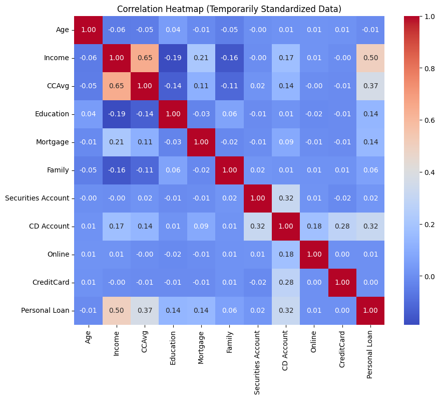
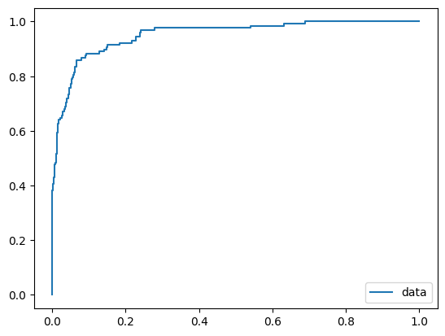
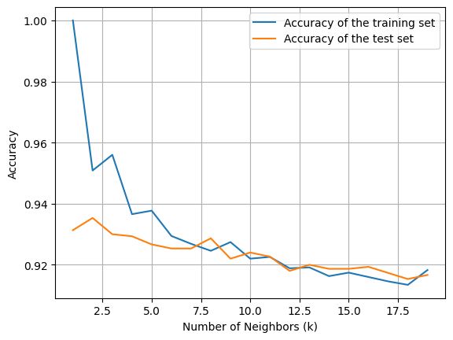

# Personal Loan Prediction

A machine-learning classification project that analyzes bank customer data and predicts whether a customer is likely to accept a personal loan.

The project combines exploratory data analysis, feature preparation, geographic exploration of ZIP codes, model comparison, cross-validation, and probability-based evaluation.

## Project Highlights

- **5,000 customer records**
- Binary target: **Personal Loan**
- Strong class imbalance: **4,520 non-acceptances vs. 480 acceptances**
- Compared **Logistic Regression**, **Gaussian Naive Bayes**, and **K-Nearest Neighbors**
- Explored customer geography by converting ZIP codes to latitude/longitude with `pgeocode`
- Used scaling and cross-validation for KNN model selection

## Model Results

| Model | Evaluation | Result |
|---|---|---:|
| Logistic Regression | Test Accuracy | **95.27%** |
| Logistic Regression | 5-fold CV Mean Accuracy | **95.12%** |
| Gaussian Naive Bayes | Test Accuracy | **88.60%** |
| KNN (`k=3`) | Base Test Accuracy | **93.00%** |
| KNN (`k=3`, scaled) | 5-fold CV Mean Accuracy | **95.83%** |
| KNN (`k=3`, scaled) | Test Accuracy | **96.73%** |

In the probability-based comparison performed in the notebook, Logistic Regression achieved the lowest log loss (**0.1246**) compared with Gaussian Naive Bayes (**0.4771**) and KNN (**0.4736**).

> Accuracy alone should be interpreted carefully because the target is imbalanced. The notebook also includes confusion matrices and classification reports to inspect class-level behavior.

## Workflow

1. Load and inspect the bank customer dataset
2. Remove `ID` and the highly correlated `Experience` feature
3. Clean the `CCAvg` field and convert it to yearly spending
4. Explore numerical and categorical variables
5. Convert ZIP codes to geographic coordinates for visualization
6. Train Logistic Regression and compare solver configurations
7. Evaluate Gaussian Naive Bayes
8. Tune KNN using feature scaling and 5-fold cross-validation
9. Compare prediction performance and log loss
10. Generate predictions for a sample customer

## Repository Structure

```text
personal-loan-prediction/
├── assets/
│   ├── correlation_heatmap.png
│   ├── knn_accuracy_by_k.png
│   └── logistic_regression_roc.png
├── data/
│   └── README.md
├── notebooks/
│   └── personal_loan_analysis.ipynb
├── results/
│   └── model_metrics.csv
├── src/
│   └── model_pipeline.py
├── .gitignore
├── README.md
└── requirements.txt
```

## Example Visualizations

### Correlation Analysis



### Logistic Regression ROC Curve



### KNN Model Selection



## Running the Project

1. Clone this repository.
2. Install dependencies:

```bash
pip install -r requirements.txt
```

3. Place the dataset in:

```text
data/Bank_Personal_Loan_Modelling.csv
```

4. Run the notebook or execute:

```bash
python src/model_pipeline.py
```

## Notes and Limitations

The dataset is substantially imbalanced, so high overall accuracy does not necessarily imply equally strong performance on customers who accept a loan. A production-oriented extension should focus more heavily on minority-class recall, precision, F1-score, PR-AUC/ROC-AUC, threshold selection, and imbalance-aware validation.

The geographic analysis is exploratory and ZIP-code coordinates are not used as predictive features in the final models.

## Possible Extensions

- Stratified train/test validation
- Class weighting or resampling methods
- ROC-AUC and PR-AUC comparison
- Threshold optimization based on business costs
- Feature importance / explainability analysis
- Ensemble models such as Random Forest or Gradient Boosting
- Reproducible experiment tracking
